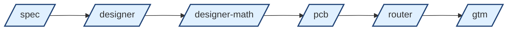
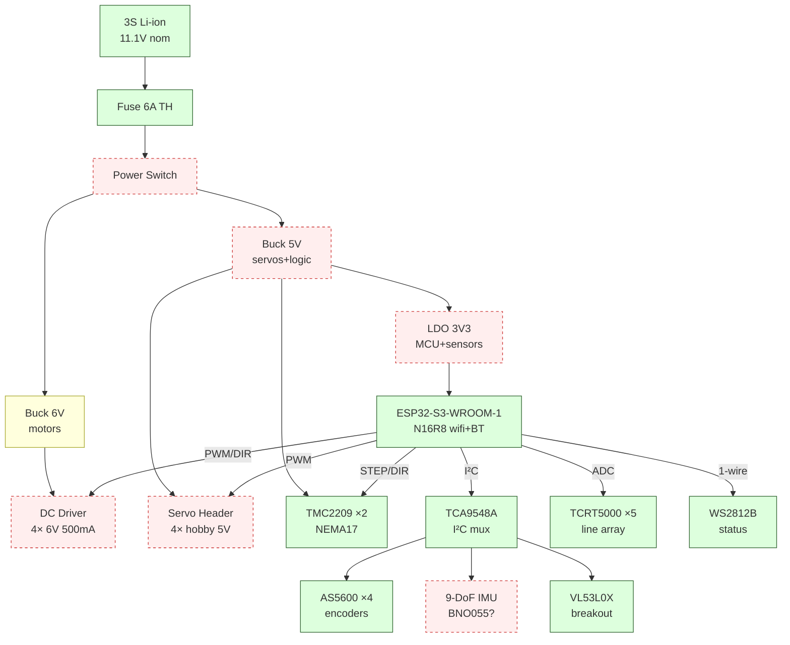

# Live Design View — control_hub_v1

## Pipeline

| stage | purpose | output |
|---|---|---|
| `/spec` | load-first intake | `profile.md` + designer-mcp requirements |
| `/designer` | pick parts (Pass 1, no math) | filled subsystems + initial schematic |
| `/designer-math` | verify (Layer 1 closed-form + Layer 2 averaged model) | pass/fail flags + part-swap suggestions |
| `/pcb` | placement, board outline, DRC | `.kicad_pcb` ready for routing |
| `/router` | autoroute via freerouting/orthoroute | routed PCB, DRC clean |
| `/gtm` | fab handoff | gerbers + drill + BOM CSV + CPL zip |

## Current architecture

**Legend:** `done` = template/locked · `wip` = picked but pending re-verify under load-first doctrine · `tbd` = needs spec lock

## Stage status

| stage | status | notes |
|---|---|---|
| /spec | **next** | run on control_hub_v1 to lock motor/servo/IMU MPNs first |
| /designer | blocked on /spec | buck_6v pick (TPS54620) will be re-checked once load MPNs lock |
| /designer-math | scaffold only | verify skeleton in `hw_agent/skills/designer-math/` |
| /pcb | scaffold only | |
| /router | scaffold only | |
| /gtm | scaffold only | |

## Doctrines (active)

1. **Load-first.** Pick actuators + sensors + MCU before sizing rails. Rails are derived.
2. **Pass 1 = pick + copy datasheet.** No math at selection time. Datasheet typical-application BOM is canonical.
3. **Pass 2 = verify on averaged model.** python-control + SciPy. SPICE only for final ripple/EMI spot-check.
4. **One-at-a-time narration.** Present each subsystem result conversationally, wait for ack.
