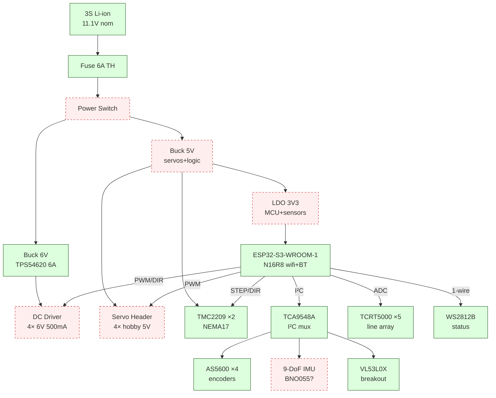

# Control Hub — Live Design View

**Legend:** `done` = part picked · `wip` = researching · `tbd` = needs research

## Subsystems to research (haiku swarm)

| # | subsystem | status |
|---|-----------|--------|
| 1 | buck_6v (motors) | **done — TPS54620RHLR** |
| 2 | buck_5v (servos+logic) | tbd |
| 3 | ldo_3v3 (MCU+sensors) | tbd |
| 4 | dc_driver (×4) | tbd |
| 5 | servo_header (×4) | tbd |
| 6 | imu_9dof | tbd |
| 7 | power_switch | tbd |

Templated / pre-committed: ESP32-S3, TMC2209, AS5600+TCA9548A, VL53L0X, TCRT5000, WS2812B, 6A glass fuse.
