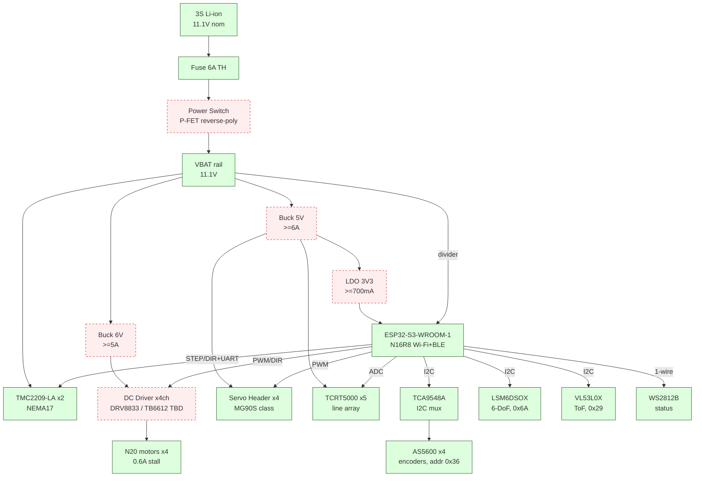

# Live Design View — control_hub_v1

## Pipeline

| stage | purpose | output | status |
|---|---|---|---|
| `/spec` | load-first intake | `profile.md` + designer-mcp requirements | ✓ done |
| `/designer` | pick parts (Pass 1, no math) | filled subsystems + initial schematic | **next** |
| `/designer-math` | verify (Layer 1 closed-form + Layer 2 averaged model) | pass/fail flags + part-swap suggestions | scaffold |
| `/pcb` | placement, board outline, DRC | `.kicad_pcb` ready for routing | scaffold |
| `/router` | autoroute via freerouting/orthoroute | routed PCB, DRC clean | scaffold |
| `/gtm` | fab handoff | gerbers + drill + BOM CSV + CPL zip | scaffold |

## Architecture (post-/spec — loads locked, rails sized but unpicked)

**Legend:** `done` = locked MPN · `wip` = under research · `tbd` = no MPN, sized but unpicked

## Stage status

| stage | status | notes |
|---|---|---|
| /spec | ✓ **complete** | all loads + sensors + MCU MPN-locked. Rail tally computed. profile.md rewritten load-first. |
| /designer | **next** | pick buck_6v, buck_5v, ldo_3v3, dc_driver, power_switch. parts-finder + parts-specker agents wired. |
| /designer-math | blocked | runs after /designer Pass 1 picks. Layer 2 averaged-model verify. |
| /pcb | blocked | runs after schematic complete. Mechanical decisions deferred here from /spec. |
| /router | blocked | autoroute via router-mcp. |
| /gtm | blocked | gerbers + BOM CSV + CPL. |

## Hook + sub-agent infra (active)

- **Statusline:** `[hardware-agent] | stage=spec | project=control_hub_v1` (after Claude Code restart)
- **SessionStart hook:** injects doctrine bullets each session
- **UserPromptSubmit hook:** per-prompt stage reminder
- **PostToolUse hook:** auto-appends `subsystem_choose_part` calls to `BUILD_LOG.md` (warn-mode for stage mismatches)
- **Sub-agents:** `parts-finder` (haiku, DK/JLC/Mouser search), `parts-specker` (haiku, datasheet->actuals)
- **Deferred sub-agents:** `pcb-placer`, `router-runner`, `kicad-editor` (write at /pcb time)

## Doctrines (active)

1. **Load-first.** Pick actuators + sensors + MCU before sizing rails. Applied this stage.
2. **Pass 1 = pick + copy datasheet.** No math at selection. Datasheet typical-application BOM is canonical.
3. **Pass 2 = verify on averaged model.** python-control + SciPy. SPICE only for final ripple/EMI spot-check.
4. **Digi-Key primary.** DK > JLC > Mouser for stock + catalog (1-5 unit prototype, hand assembly).
5. **One-at-a-time narration.** Present each subsystem result conversationally, wait for ack.
6. **Announce workspace paths.** State file paths before editing.
