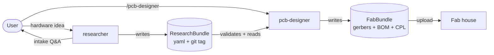
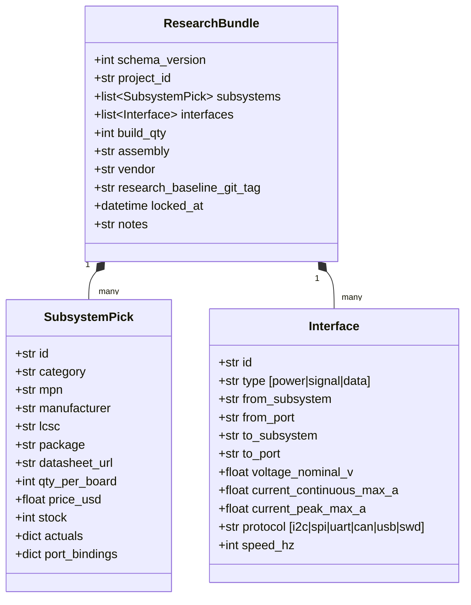
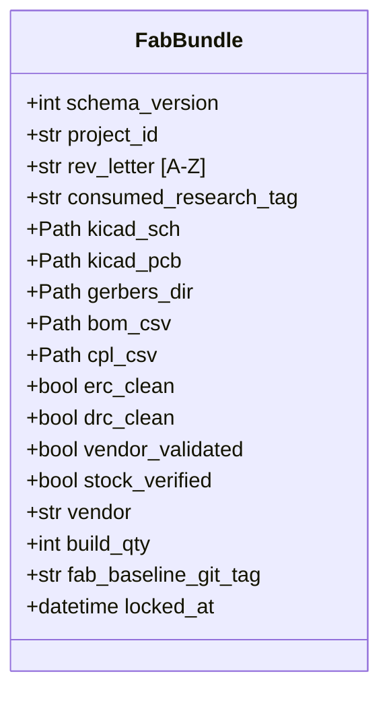
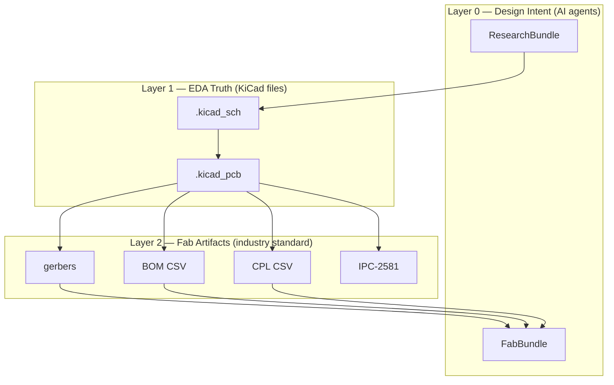
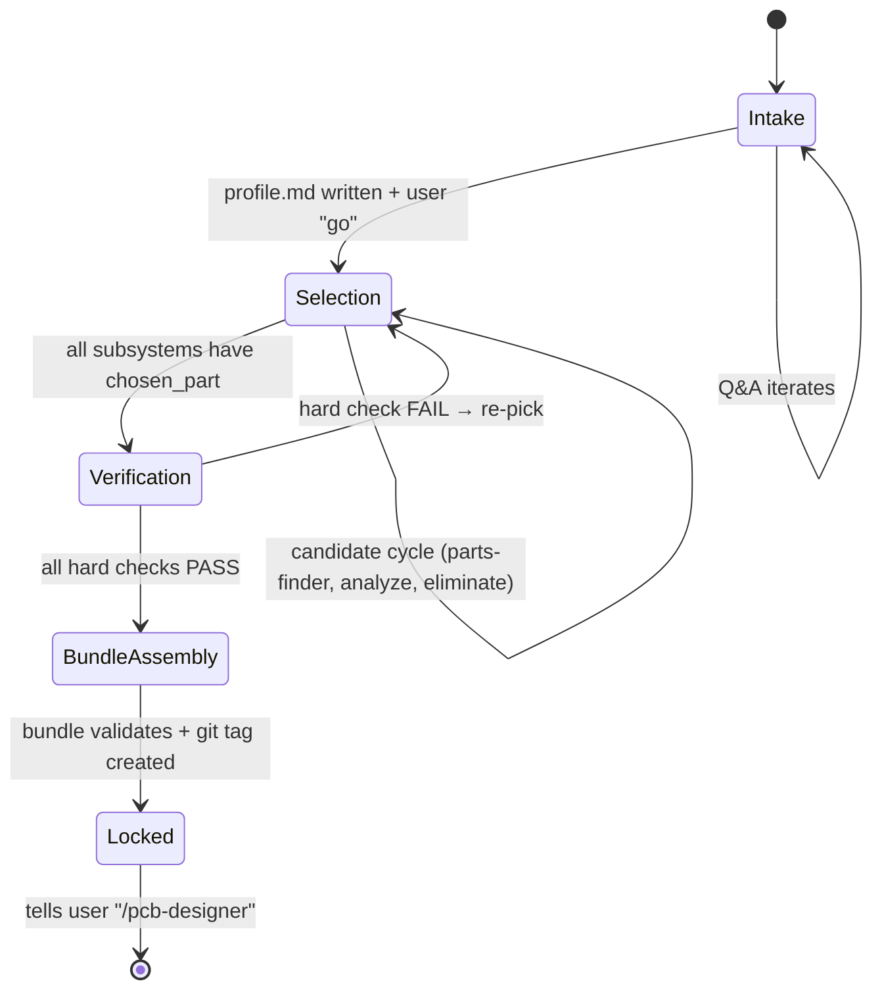
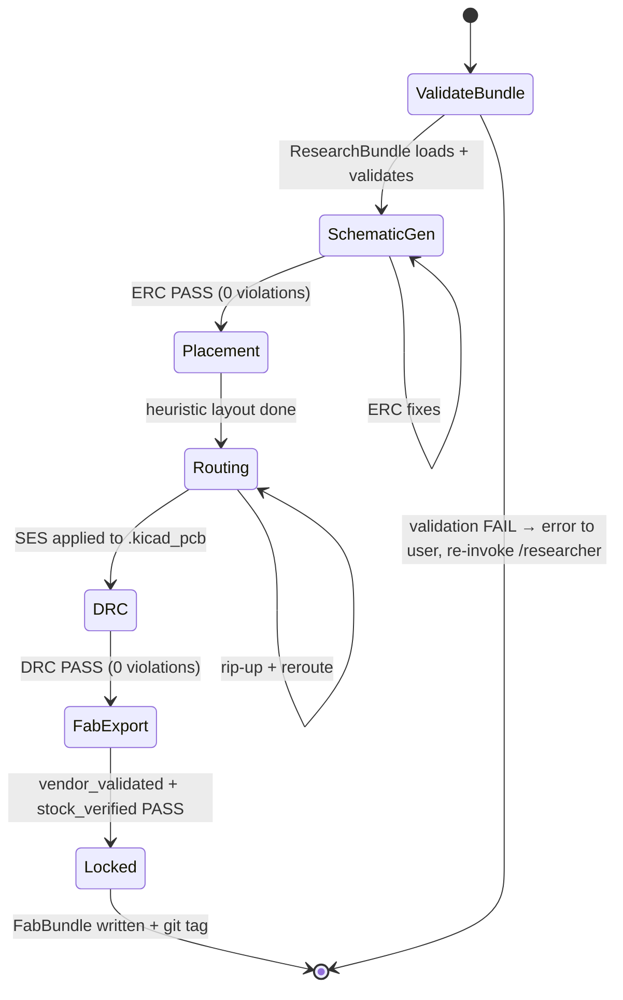
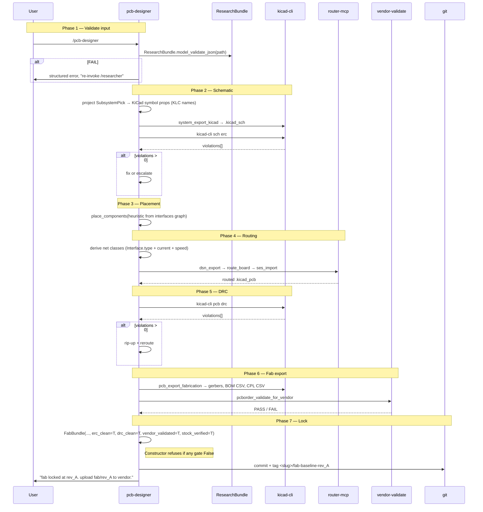
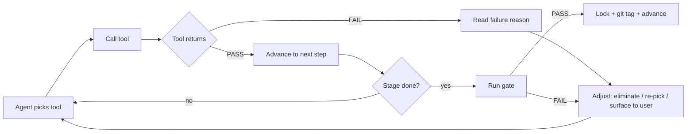
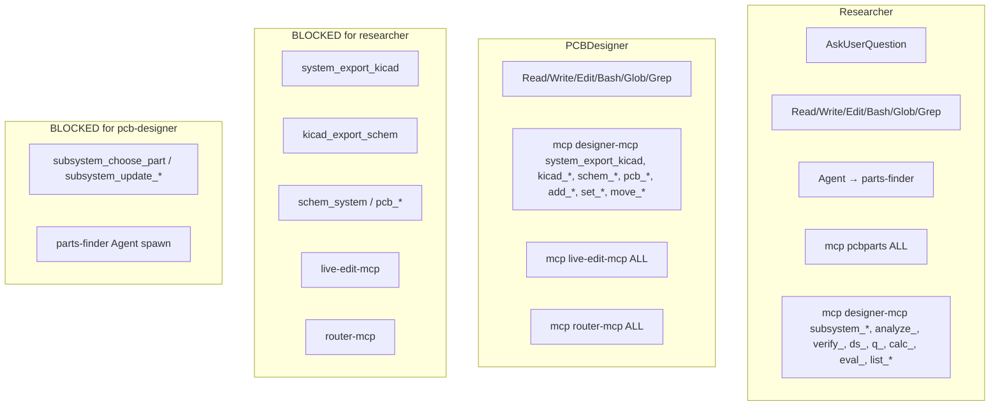

# hw-toolkit — Design

**One doc. All architecture, flows, contracts, rules.** Mermaid for everything that flows. Tables for everything that doesn't.

---

## 1. The 4 convictions

1. **Skills are slim.** Procedural step-lists, no doctrine.
2. **Tools give feedback.** Every action returns PASS/FAIL/result.
3. **Feedback drives design.** Next move comes from last tool's output, not the agent's plan.
4. **Re-inject every turn.** Doctrine, state, gate status → emitted via hooks each turn. The LLM drifts; the hook can't.

Everything below derives from these 4. Argue with these first.

---

## 2. Two-agent architecture



**Two agents. One contract crossing between them.** Nothing else.

| stage | agent | input | output |
|---|---|---|---|
| 1 | `researcher` | user intent | `research_bundle.yaml` + git tag |
| 2 | `pcb-designer` | `research_bundle.yaml` | gerbers, BOM, CPL + git tag |

---

## 3. Contract — 2 pydantic models

Live at `hw_agent/core/`. **Locked. Do not edit lightly.**

| model | file | role | mutability |
|---|---|---|---|
| `ResearchBundle` | `research_bundle.py` | input contract (researcher → pcb-designer) | written once, read-only after lock |
| `FabBundle` | `fab_bundle.py` | output contract (pcb-designer → fab) | `frozen=True`, gate-validated |

### `ResearchBundle` shape



**Validators (fire on construct):**
- Subsystem ids unique
- Interface ids unique
- Interface endpoints reference real subsystems (or `"external"`)
- Port bindings reference real interfaces
- power needs voltage, signal/data needs protocol
- current_peak ≥ current_continuous

### `FabBundle` shape



**Validators (fire on construct):**
- All paths relative (under project tree)
- ALL gate bools must be True → failing-gate FabBundle is unconstructible

---

## 4. Layer model



Each layer is owned by one party. Layer 0 = us. Layer 1 = KiCad. Layer 2 = fab house standards.

Existing interchange formats (IPC-2581, ODB++, EDIF) live at L2. They do NOT carry design intent. That's why we have our own L0.

---

## 5. Researcher flow



### Stage detail

```mermaid
sequenceDiagram
    participant U as User
    participant R as researcher
    participant PF as parts-finder
    participant MCP as designer-mcp
    participant DK as pcbparts (DK/JLC)
    participant Git as git

    Note over U,R: Stage A — Intake
    U->>R: hardware idea (one-liner)
    R->>U: AskUserQuestion (rails, loads, MCU, sensors)
    U-->>R: answers
    R->>R: write profile.md
    U->>R: "go"

    Note over R,DK: Stage B — Selection (per subsystem)
    R->>MCP: subsystem_add(buck_6v, requirements)
    R->>PF: spawn (requirements)
    PF->>DK: digikey_get_part / jlc_search
    DK-->>PF: candidates + stock
    PF-->>R: ranked candidates
    R->>MCP: analyze_candidate(top pick)
    MCP-->>R: PASS / FAIL
    alt FAIL
        R->>R: eliminate, try next candidate
    else PASS
        R->>MCP: subsystem_choose_part(rationale, rejected[])
    end

    Note over R,MCP: Stage C — Verification
    R->>MCP: eval_subsystem(buck_6v) — runs calc_*
    MCP-->>R: PASS / FAIL with verdict
    alt FAIL
        R->>U: surface; propose re-pick or relax
    end

    Note over R,Git: Stage D — Bundle assembly
    R->>R: build ResearchBundle dict from subsystems[] + interfaces[]
    R->>R: validate via ResearchBundle.model_validate(...)
    R->>R: write research_bundle.yaml
    R->>Git: commit + tag <slug>/research-baseline-YYYYMMDD
    R->>U: "research locked. invoke /pcb-designer"
```

### What researcher writes

Single artifact: `docs/projects/<slug>/research_bundle.yaml`. Plus git tag. **No** separate `n2_matrix.yaml`, `manifest.yaml`, per-interface yaml. One bundle, one home.

---

## 6. PCB-designer flow



### Stage detail



---

## 7. Feedback loop (the universal pattern)



**The agent never plans 5 steps ahead.** It calls one tool, reads the result, picks the next call. Tool feedback IS the plan.

---

## 8. Hard rules per agent

### researcher

| # | rule | enforcement |
|---|---|---|
| 1 | Load-first: loads before rails | hook + soft |
| 2 | DK primary, JLC secondary, Mouser tertiary | soft |
| 3 | Provenance on every actual (`<key>__source`) | soft |
| 4 | Append-only decisions | convention |
| 5 | Pass 1 = no math at part selection | hook + soft |
| 6 | Bundle must validate before tagging | code: ResearchBundle.model_validate |
| 7 | Out-of-scope tools blocked | PreToolUse hook + whitelist |

### pcb-designer

| # | rule | enforcement |
|---|---|---|
| 1 | READ-ONLY on research artifacts | PreToolUse hook |
| 2 | Never edit schema (`hw_agent/core/*.py`) | PreToolUse hook |
| 3 | Symbol props derived from `SubsystemPick`, never hand-edited | convention |
| 4 | No rev bump without `ready_to_fab` gate PASS | code: FabBundle constructor |
| 5 | ERC + DRC = 0 violations before fab | code |
| 6 | Found bad pick → STOP, error, re-invoke researcher | convention |
| 7 | Output only in `kicad/` and `fab/rev_<X>/` | convention |
| 8 | Failing-gate FabBundle = unconstructible | code: model_validator |

---

## 9. Tools whitelist per agent



**Disjoint whitelists. PreToolUse hook enforces.**

---

## 10. Doctrine injection (every turn)

```mermaid
sequenceDiagram
    participant U as User
    participant Hook as user_prompt_submit hook
    participant State as project state
    participant Doctrine as harness/doctrine.yaml
    participant Agent as researcher OR pcb-designer

    U->>Hook: types prompt
    Hook->>State: read stage (intake/spec/designer/pcb)
    Hook->>Doctrine: rules_for_stage(stage)
    Doctrine-->>Hook: [load_first, pass1_no_math, digikey_primary, bom_ceiling]
    Hook->>Agent: <system-reminder> with rules + state + project + tools
    Note over Agent: Agent re-reads every turn; can't drift
    Agent->>Agent: reasons + picks tool
```

**Doctrine lives in `hw_agent/harness/doctrine.yaml`.** Each rule = `{id, text, soft.stages, hard.tool, hard.validator}`. Soft = injected. Hard = PreToolUse rejection.

Current rules:

| id | stages | hard? |
|---|---|---|
| `load_first` | intake, spec | yes — blocks `subsystem_add` if loads not locked |
| `pass1_no_math` | designer | soft only |
| `digikey_primary` | designer | soft only |
| `bom_ceiling` | designer, pcb | yes — blocks `subsystem_choose_part` if over budget |

---

## 11. File layout

```
hw-toolkit/
├── hw_agent/
│   ├── core/
│   │   ├── research_bundle.py        ← input contract
│   │   ├── fab_bundle.py             ← output contract
│   │   ├── subsystem.py              ← legacy, still used by designer-mcp
│   │   └── ... (orchestrator, design_tree, preview)
│   ├── harness/
│   │   ├── doctrine.yaml             ← rules registry
│   │   └── validators.py             ← hard rule validators
│   ├── .claude/
│   │   ├── agents/
│   │   │   ├── researcher.md         ← stage-1 agent
│   │   │   ├── parts-finder.md       ← sub-agent (haiku)
│   │   │   └── parts-specker.md      ← sub-agent
│   │   ├── commands/                 ← /designer /pcb /spec etc. (legacy skills)
│   │   ├── hooks/                    ← session_start.sh, user_prompt_submit.sh
│   │   └── settings.json
│   └── scripts/                      ← misc python scripts
│
├── mcp_server/                       ← designer-mcp, live-edit-mcp, router-mcp, pcbparts
├── hw-router-service/                ← self-hosted FreeRouting/OrthoRoute
│
├── docs/
│   ├── architecture/
│   │   ├── DESIGN.md                 ← THIS FILE (single source)
│   │   └── HANDOFF_PCB_DESIGNER.md   ← copy-paste prompt for fresh session
│   ├── investigations/payloads/      ← evidence files per tool (KiCad, SPICE, etc.)
│   ├── investigations/prior_art/     ← evidence files per HDL/standard
│   └── projects/<slug>/              ← per-project artifacts
│       ├── profile.md                ← human intake
│       ├── research_bundle.yaml      ← THE ONE researcher output
│       ├── subsystems/*.json         ← intermediate per-subsystem store (legacy MCP)
│       ├── kicad/                    ← pcb-designer output (sch + pcb)
│       └── fab/rev_<X>/              ← pcb-designer output (gerbers, BOM, CPL)
│
└── .claude/                          ← mostly symlinks to hw_agent/.claude/
```

---

## 12. Status

| component | state |
|---|---|
| `ResearchBundle` + `FabBundle` pydantic contracts | **locked** (validates) |
| `researcher` agent definition | **drafted** (`hw_agent/.claude/agents/researcher.md`) |
| `pcb-designer` agent definition | not yet (handoff prompt exists) |
| `parts-finder` sub-agent | exists (legacy, works) |
| Doctrine + injection hooks | works (load_first, pass1_no_math, digikey_primary, bom_ceiling) |
| `live_visual_only` doctrine | **dropped** |
| Per-module design docs | **deprecated by this file** |
| `control_hub_v1` project | intake done, buck_6v failing gate (Iout 5A < required 6A) |

---

## 13. Next steps (priority order)

1. Resolve `control_hub_v1` buck_6v (re-pick or relax margin) — first real test of the harness.
2. Fix `fitz` (PyMuPDF) so template + datasheet MCP tools work.
3. Smoke-test `/researcher` invocation on `control_hub_v1`.
4. Write `pcb-designer.md` agent file (handoff prompt is the spec).
5. Implement Phase 1 of pcb-designer (validate ResearchBundle, refuse if fail).

---

## 14. What we deliberately did NOT do

- No separate `n2_matrix.yaml`, `manifest.yaml`, per-interface yaml. One bundle, one home.
- No `TrackedValue` / `EEResult` / `ProjectManifest` pydantic models. The contract is 2 models.
- No per-module design docs. This file is the single source.
- No live `.live/*.md` pane discipline. Visualizer handles that if needed.
- No `InterfaceDefinition` reusable spec layer (v2 candidate).
- No P-Port / R-Port asymmetry (v2 candidate).
- No IBIS support (v2 candidate).
- No skill `.md` doctrine files. Doctrine lives in `harness/doctrine.yaml` and is injected by hooks.
