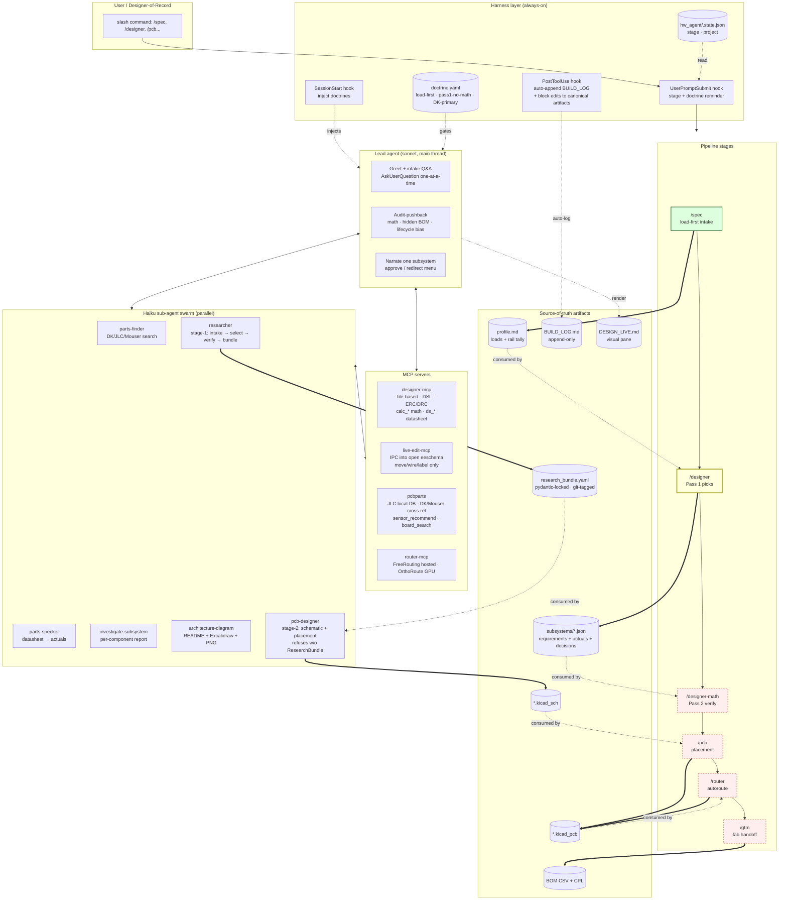

# hw-toolkit — Flow Overview

> Single-page bird's-eye of the whole pipeline. Open this in a VS Code preview pane while working through `/spec → /designer → ... → /gtm`. Read top-to-bottom: diagram → big ideas.

## End-to-end flow

## Big ideas worth stealing into other agent systems

### 1. Doctrine = injected, not documented
Doctrines (`load-first`, `pass1-no-math`, `DK-primary`) live in **harness hooks** that re-inject every turn — not in a README. Drift-proof. Model can't "forget" rules.

> **Steal it for:** any long-running agent with guardrails (security policies, coding conventions, deploy gates).

### 2. Two-pass design = selection ≠ verification
- **Pass 1** (`/designer`): copy datasheet typical-app BOM verbatim, NO math.
- **Pass 2** (`/designer-math`): averaged-model verify, fb divider math, thermal gate.

Breaks the infinite "compute fb resistors → wrong → swap part → recompute" loop.

> **Steal it for:** anything where cheap-LLM picks and expensive-tool verifies. **Pick first, justify second.**

### 3. Typed locked bundle as agent boundary
`research_bundle.yaml` is pydantic-gated. `pcb-designer` **refuses to start** until it validates. Git-tagged. Append-only decisions.

> **Steal it for:** any agent-to-agent handoff. Use a **typed serialized artifact + version tag**, not chat history.

### 4. Lead audits haiku swarm BEFORE narrating
Mandatory "review-pushback rule": sonnet lead re-checks haiku math, cost-ratio claims, hidden BOM cost, lifecycle bias **before** passing pick to user. Counter-proposal shown alongside haiku pick when audit finds a problem.

> **Steal it for:** **cheap parallel research + expensive serial audit**. Don't trust haiku rejections blindly.

### 5. One-at-a-time narration with `AskUserQuestion` menu
Each subsystem result presented alone. Wait for explicit approve/redirect via structured menu, not prose. Memory rule = `feedback_designer_narration_style`.

> **Steal it for:** bounded structured choice > open-ended "ok?". User redirects cheap, ambiguity dies.

### 6. Feedback rep ladder (cheap → rich)
ERC JSON parse → netlist → PNG render → SVG. **Pick ONE per turn.** Don't ship all four to context.

> **Steal it for:** any verify loop: **token-cheap → semantic-rich**, only escalate when needed.

### 7. Live panes are visual-only
`DESIGN_LIVE.md`, `BUILD_LOG.md`, schematics, renders = engineer SEES in VS Code panes. Chat = text reasoning. Memory rule = `feedback_live_panes_visual_only`.

> **Steal it for:** split read-channels — visual artifact for human eye, text artifact for model reasoning.

### 8. Sub-agents have narrow tool whitelists
`researcher` agent literally cannot call `pcb_*`, `live-edit*`, `router-mcp__*`. Hook blocks attempts.

> **Steal it for:** agents get **smallest tool-belt that completes their phase**. Stops scope creep + accidental destructive calls.

### 9. Sourcing priority as doctrine, not preference
DK > JLC > Mouser. Every actual annotated with `<field>__source` companion key (`datasheet`, `dk`, `jlc`, `measured`, `ai_estimated`, `user`). Provenance lives next to data.

> **Steal it for:** every fact pinned to where-from. Auditable. No bare numbers.

### 10. Worktree isolation for parallel swarm (TODO)
Phase 4 swarm permission-gated noise → planned move to `isolation: "worktree"` so haiku agents run unattended. Intake stays in main context. (Tracked in `project_designer_isolated_env_todo` memory.)

> **Steal it for:** **interactive in main, batch in worktree**.

## Related

- `docs/architecture/README.md` — top-level architecture
- `docs/architecture/LAYER_MODEL.md` — 3-layer altitude model
- `docs/architecture/HANDOFF_PCB_DESIGNER.md` — researcher → pcb-designer contract
- `hw_agent/skills/designer/designer.md` — Pass 1 skill prompt
- `hw_agent/.claude/agents/researcher.md` — Stage-1 agent
- `.claude/agents/pcb-designer.md` — Stage-2 agent
- `DESIGN_LIVE.md` — live project view (control_hub_v1)
- `BUILD_LOG.md` — append-only build log
