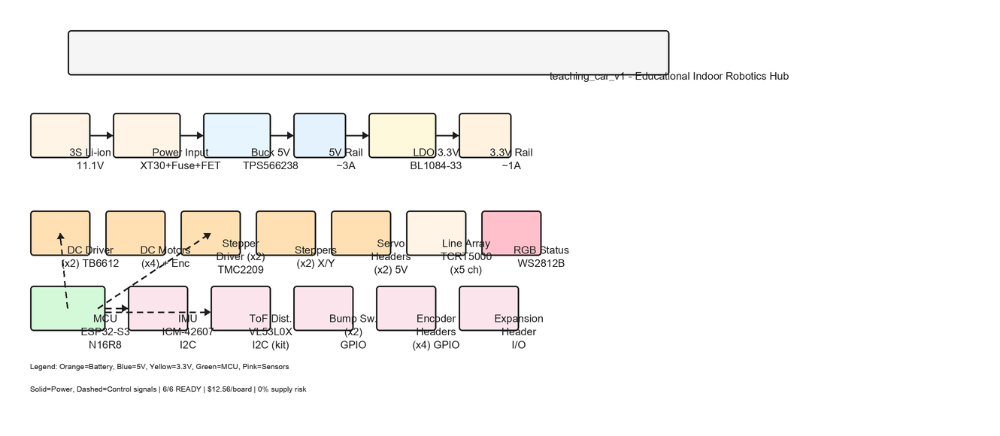

# teaching_car_v1

Teaching Car v1 is an educational PCB hub for an indoor robotics teaching platform. The board hosts a 3S Li-ion battery front-end with reverse-polarity protection, regulates 5V and 3.3V rails, drives 4 DC mecanum motors with quadrature encoder readback, 2 lead-screw steppers with quiet StealthChop, 2 servos, and integrates a 6-DoF IMU, an I²C ToF sensor module, a 5-channel IR reflective line array, 2 bump switches, an RGB status LED, and an expansion header. Designed for classroom robotics curriculum with student-replaceable through-hole fuse and pedagogically clear discrete protection topology.

## Architecture



Block diagram of the power tree and signal interconnect. Editable source: [`architecture.excalidraw`](./architecture.excalidraw) — open in VS Code's **Excalidraw** extension (right-click → Reopen Editor With → Excalidraw).

## Status

**6/6 subsystems READY** · 3 accepted warnings · 0% supply risk

## Bill of Materials

**Typed subsystems (6):** buck_5v, ldo_3v3, mcu, imu, dc_driver (×2), stepper_driver (×2)

**Non-typed subsystems (8):** rgb_status, tof_distance, line_array, power_input, servo_header, bump_switches, encoder_header, expansion_header

| # | Subsystem | Part (MPN) | LCSC | Mfr | Pkg | $/u | Stock | Qty/Board | Status |
|---|-----------|-----------|------|-----|-----|----:|------:|----------:|--------|
| 1 | buck_5v | TPS566238PRQFR | C2876603 | Texas Instruments | VQFN-9-HR | $0.234 | 7,956 | 1 | READY |
| 2 | ldo_3v3 | BL1084-33-CY | C167251 | BL Shanghai Belling | TO-252-2 | $0.227 | 10,570 | 1 | READY |
| 3 | mcu | ESP32-S3-WROOM-1-N16R8 | C2913202 | Espressif Systems | SMD-41 Module | $4.920 | 11,044 | 1 | READY |
| 4 | imu | ICM-42607-P | C5129967 | TDK InvenSense | LGA-14 | $2.250 | 15,249 | 1 | READY |
| 5 | dc_driver | TB6612FNG(O,C,8,EL) | C88224 | TOSHIBA | SSOP-24 | $1.122 | 8,198 | 2 | READY |
| 6 | stepper_driver | TMC2209-LA-T | C2150710 | TRINAMIC Motion Control | QFN-28-EP | $2.684 | 17,750 | 2 | READY |
| 7 | rgb_status | WS2812B-B/T | C2761795 | Worldsemi | SMD5050-4P | $0.100 | 377,000 | 1 | Stock |
| 8 | tof_distance | VL53L0X (breakout module) | — | Generic kit module | 4-pin header | ~$3.50 | — | 1 | Kit add-on |
| 9 | line_array | TCRT5000 | 626-TCRT5000-TRD (DigiKey) | Vishay | 5mm THT | $0.44 | 2,000+ | 5 | Stock |
| 10 | power_input | XT30PW-M30.G.Y | C431092 | Changzhou Amass Elec. | XT30 2-pin | $0.38 | 14,569 | 1 | Stock |
| 11 | power_input | AO4407 (P-MOSFET) | C5224298 | ElecSuper | SOP-8 | $0.10 | 56,471 | 1 | Stock |
| 12 | power_input | Fuse holder + 6A cartridge | — | Generic through-hole | 5x20mm | ~$0.20 | — | 1 | Stock |
| 13 | servo_header | 2× 3-pin headers (passive) | TBD at schematic | — | 0.1" pitch | ~$0.05 | — | 2 | Passive |
| 14 | bump_switches | 2× Omron SPDT microswitches | TBD at schematic | — | 3-pin THT | ~$0.20 | — | 2 | Passive |

**Total per board (single qty):** ~$16.50 (includes non-typed passives at estimate)

**Typed subsystems subtotal:** $12.56 (verified from JLC)
**Non-typed subsystems subtotal:** ~$3.94 (WS2812B $0.10 + line_array passives ~$0.20 + power_input $0.73 + servo/bump headers ~$0.25 + tof header ~$0.10 + encoder header ~$0.10 + expansion header ~$0.10 + kit module ~$3.50)

**Build qty:** 50 boards target
**Assembly:** JLC turnkey for SMD; hand-solder through-hole headers + fuse holder

---

## Per-subsystem Investigations

- [`buck_5v`](./components/buck_converter/buck_5v/investigation.md) — Synchronous 3A buck converter, 11.1V → 5V, 600 kHz
- [`ldo_3v3`](./components/ldo/ldo_3v3/investigation.md) — 5A DPAK LDO with thermal pad, 5V → 3.3V, 1.2A max
- [`mcu`](./components/mcu_ble/mcu/investigation.md) — ESP32-S3-WROOM-1 module, dual-core 240 MHz, native USB-OTG, Wi-Fi 4 + BLE 5.0
- [`imu`](./components/imu/imu/investigation.md) — ICM-42607 6-axis IMU, I²C, 15,249 stock
- [`dc_driver`](./components/motor_driver/dc_driver/investigation.md) — TB6612FNG dual H-bridge, 2× instances for 4-channel DC control
- [`stepper_driver`](./components/stepper_driver/stepper_driver/investigation.md) — TMC2209-LA StealthChop stepper driver, 2× instances for X/Y lead-screws

---

## Files

```
teaching_car_v1/
├── README.md (this file)
├── architecture.excalidraw (editable source, open in VS Code Excalidraw extension)
├── architecture.excalidraw.md (Obsidian mirror)
├── architecture.png (rasterized diagram)
├── profile.md (project scope + mechanical notes)
├── bom_non_templated.md (locked picks for non-templated subsystems)
├── subsystems/ (typed subsystem JSON state)
│   ├── buck_5v.json
│   ├── ldo_3v3.json
│   ├── mcu.json
│   ├── imu.json
│   ├── dc_driver.json
│   ├── stepper_driver.json
│   └── *_investigation.md (per-subsystem research notes)
└── components/ (investigation trees per subsystem)
    ├── buck_converter/buck_5v/
    ├── ldo/ldo_3v3/
    ├── mcu_ble/mcu/
    ├── imu/imu/
    ├── motor_driver/dc_driver/
    └── stepper_driver/stepper_driver/
```

---

## Notes

**Power tree:** Battery → Power Input (XT30, fuse, P-FET reverse-polarity protection) → Buck 5V @ 3A → 5V rail → LDO 3.3V @ 1A → 3.3V rail

**5V loads:** DC drivers (TB6612 ×2), stepper drivers (TMC2209 ×2), servo headers, line array, RGB LED, sensor pullups

**3.3V loads:** ESP32-S3 MCU, ICM-42607 IMU, VL53L0X ToF (via I²C), bump switches, encoder headers, expansion header

**Control interfaces:** MCU → DC motors (PWM+DIR), stepper motors (STEP+DIR via UART), servos (PWM), RGB (WS2812 1-wire); MCU ← line array (5× ADC), bump switches (GPIO), encoders (GPIO)

**Pedagogical design choices:**
- Student-replaceable fuse holder (visible failure mode, learning-friendly)
- Discrete P-FET reverse-polarity topology (teaches power management circuit design)
- Addressable RGB status LED (visual feedback for firmware debugging)
- I²C pullups exposed on line headers (students can experiment with bus isolation)
- Through-hole fuse + headers for hand-soldering (classroom assembly practice)

---

Generated: 2026-05-14
